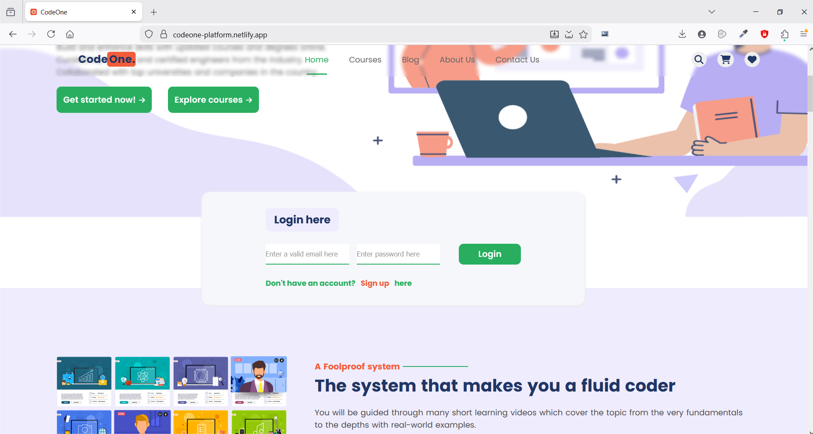
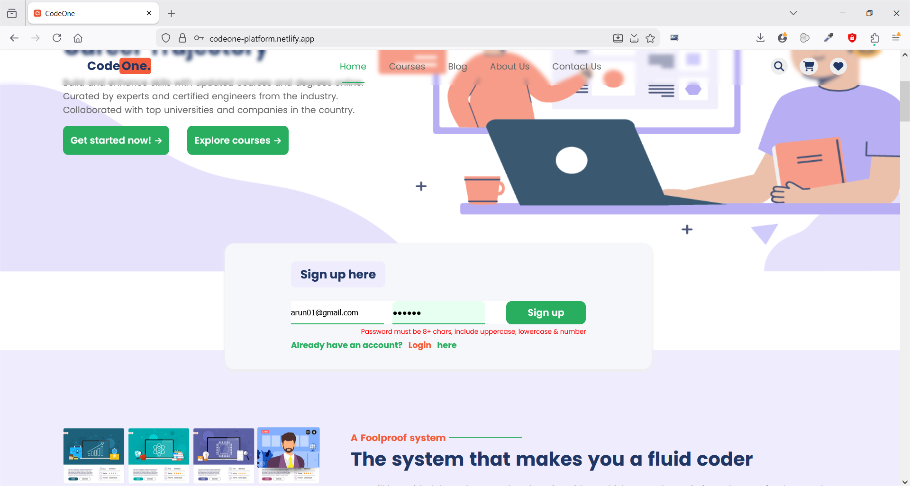
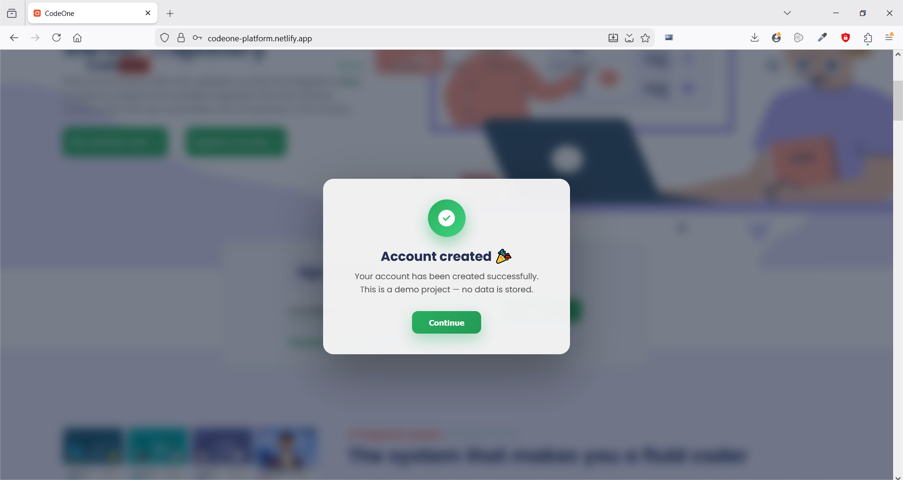
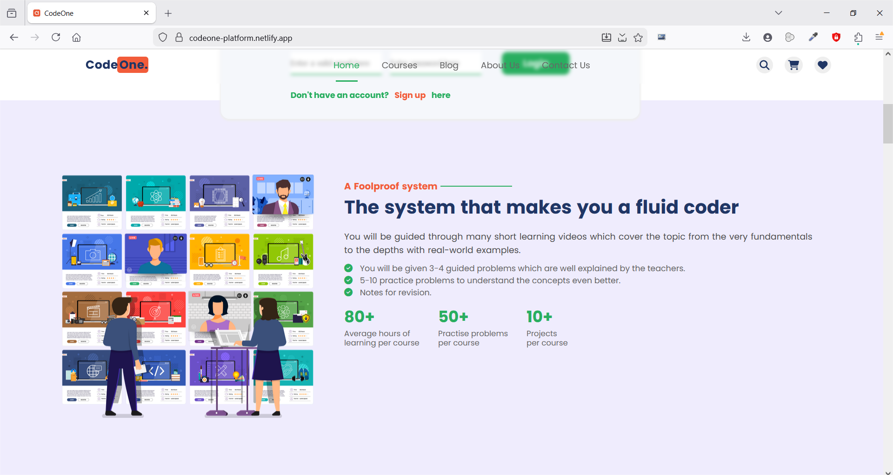
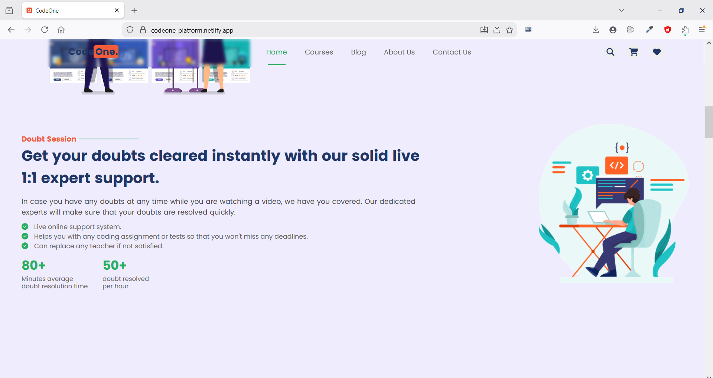
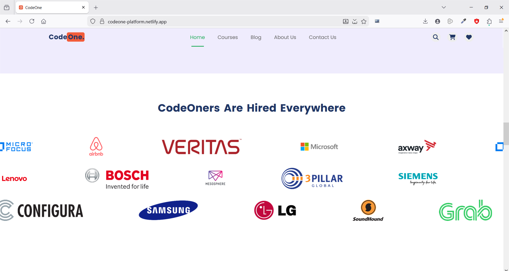
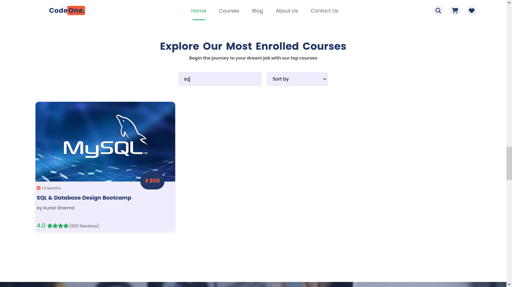
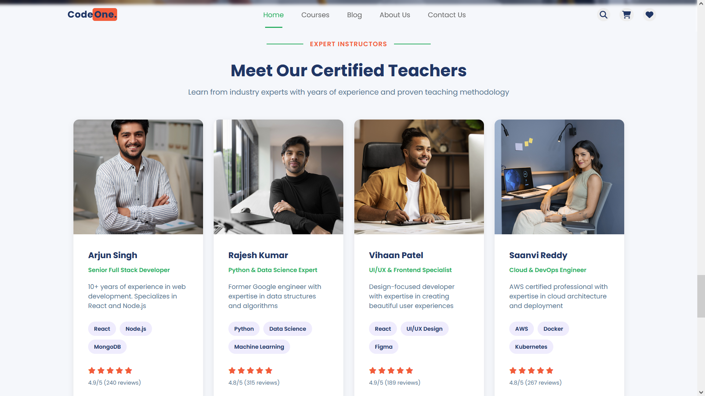
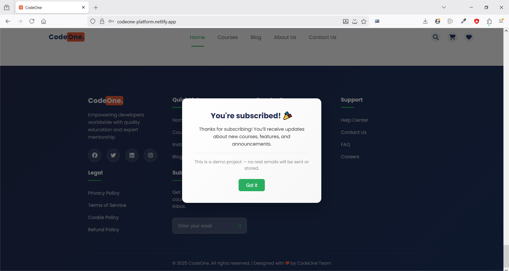

# CodeOne — Frontend Ed-Tech Platform (UI Engineering Demo)

**CodeOne** is a **frontend-only ed-tech landing platform** built to demonstrate **advanced DOM manipulation, scalable SCSS architecture, and interaction-heavy UI engineering** — all within a single, long-form homepage.

Rather than relying on frameworks or backend logic, this project intentionally focuses on  **fundamentals done deeply** :
layout composition, animation systems, stateful DOM behavior, and production-style SCSS structuring.

---

## 🎯 Project Purpose

CodeOne was built to answer:

> *How much real engineering depth can be shown using just HTML, SCSS, and JavaScript?*

This project emphasizes:

* DOM-driven UI state management
* Scroll-based and interaction-based animations
* Modular SCSS architecture
* Interactive, data-like behaviors without a backend
* Clean separation of structure, style, and logic

---

## 🔗 Live Demo

👉 [codeone-platform.netlify.app](https://codeone-platform.netlify.app)

---

## 🖼️ Screenshots

### 🚀 Header & Navigation

**Sticky and responsive navigation with active link highlighting, Dynamic CTA interactions and entrance animations triggered via CSS**


..................................................................................................

### 🔐 Login / Signup Form

**Client-side form validation, error handling, and success modal rendered via DOM state updates**





..................................................................................................

### 🧩 Floating Feature Sections (4 Sections)

**Scroll-triggered DOM reveal logic with alternating layout , alternating animation style, and mini-stats. (2 Sections shown)**




..................................................................................................

### 🏷️ Trusted Brands Marquee

**DOM-driven infinite marquee loop with seamless element cloning for continuous motion**



..................................................................................................

### 📚 Courses Section

**DOM-based filtering, sorting (price & rating), debounced search, and staggered reveal animations**





..................................................................................................

### 📊 Credentials / Platform Stats

**Animated counters driven by DOM intersection events and incremental value updates**


..................................................................................................

### 👨‍🏫 Certified Teachers

**Direction-aware hover detection, DOM-based tilt calculations, and image zoom effects**



..................................................................................................

### 💬 Reviews & Testimonials

**Carousel logic with DOM-controlled slide transitions, hover-based parallax tracking, and magnetic cursor attraction**


..................................................................................................

### 📩 Footer & Newsletter

**Email validation, error messaging, and responsive confirmation modal injected via DOM manipulation**




---

## 🎯 Project Purpose

This project emphasizes:

* DOM-driven UI state management
* Scroll-based and interaction-based animations
* Modular SCSS architecture
* Interactive, data-like behaviors without a backend
* Clean separation of structure, style, and logic

---

## 🧱 Page Structure & Sections

### 1️⃣ Header / Navigation

* Sticky header behavior
* Responsive layout handling
* Prepared for real navigation flows

..................................................................................................

### 2️⃣ Hero Section

* Primary value proposition
* CTA-driven layout
* Entry animations using SCSS
* Balanced typography and spacing

..................................................................................................

### 3️⃣ Login / Sign-Up UI (Frontend Only)

* Input validation using JavaScript
* Error and success states handled via DOM
* **Success modal shown on valid login**
* Clear demo disclaimer (no real submission)

⚠️ *UI demo only — no real authentication*

..................................................................................................

### 4️⃣ Floating Feature Sections (4 Sections)

* Four floating sections
* Alternating image + content layouts
* Alternating animation styles per section
* Scroll-based reveal logic via DOM
* Mini stats embedded inside each section
* SCSS-driven animations coordinated with JS triggers

This section showcases  **DOM + SCSS animation orchestration** .

..................................................................................................

### 5️⃣ Trusted Brands Infinite Marquee

* Seamless infinite scrolling marquee
* Performance-aware animation
* CSS + JS coordination
* Designed to feel subtle, not distracting

..................................................................................................

### 6️⃣ Courses Section (Interactive)

Courses are **not static cards** — they behave like data.

**DOM-driven features:**

* Sort by:
  * Price (low → high)
  * Price (high → low)
  * Reviews (high → low)
* Search/filter courses in real time
* Animated reveal on scroll
* Responsive grid layout

All logic is handled on the frontend using JavaScript.

..................................................................................................

### 7️⃣ Platform Stats Section

* Animated counters triggered on scroll
* JavaScript-controlled number increments
* Smooth SCSS animations
* Clean emphasis on key metrics

..................................................................................................

### 8️⃣ Instructors Section (Advanced Hover Interactions)

One of the most technically expressive sections.

**Features:**

* Image zoom on hover
* Direction-aware card tilt
* Mouse-based interaction detection
* Smooth SCSS transitions coordinated with JS

Demonstrates  **precision DOM interaction control** .

..................................................................................................

### 9️⃣ Reviews / Testimonials

* Testimonial carousel
* JavaScript-controlled sliding logic
* Hover interactions:
  * Cards subtly move with cursor
  * Magnetic/parallax-style attraction on initial hover
* Direction-aware movement for natural feel

Focus:  **interaction realism**

..................................................................................................

### 🔟 Footer + Newsletter

* Multi-column footer layout
* Newsletter subscription UI
* JavaScript-controlled modal feedback
* Clear demo disclaimer (no real submission)

---

## ✨ Core Strengths

### 🧠 DOM Manipulation

CodeOne heavily uses JavaScript for UI behavior:

* Scroll-based section reveals
* Alternating animation logic per section
* Course sorting & searching
* Testimonial carousel
* Login/sign-up validation & success modal
* Animated stat counters
* Direction-aware hover interactions
* Cursor-based parallax/magnetic effects

No libraries. No shortcuts.

..................................................................................................

### 🎨 SCSS Architecture

```
scss/
├── abstracts/
│   ├── _variables.scss
│   ├── _animations.scss
│   
├── base/
│   │── _globals.scss
├── components/
│   ├── _authModal.scss
│   ├── _header.scss
│   ├── _heroSection.scss
│   ├── _loginForm.scss
│   ├── _featuresFloatSection.scss
│   |── _brandsMarquee.scss
│   |── _coursesSection.scss
│   |── _credentialsSection.scss
│   |── _certifiedTeachersSection.scss
│   ├── _credentialsSection.scss
│   |── _studentReviews.scss
│   └── _footer.scss
│   |── _newsletterModal.scss
└── main.scss
```

**Why this matters:**

* Scalable styling
* Predictable overrides
* Reusable animations
* Production-grade structure

---

## 📱 Responsiveness

* Fully responsive across devices
* Section-specific breakpoints
* No layout hacks or overflow issues
* Animations adapt to screen size

---

## 🛠 Tech Stack

- HTML5
- SCSS
- Vanilla JavaScript (ES6+)
  - Explicit DOM manipulations & state management
  - Event-driven UI updates

---

## 🧠 Frontend Engineering Focus

CodeOne focuses on practicing and showcasing core frontend concepts through a single, well-structured landing page:

- Strong HTML, CSS, and JavaScript fundamentals
- Managing complex UI interactions without frontend frameworks
- Scalable SCSS architecture (abstracts, components, animations)
- Event-driven DOM updates and state-based UI changes
- Purposeful animations that are minimal and modern that also support clarity and interaction

---

## 📄 License

MIT

---
